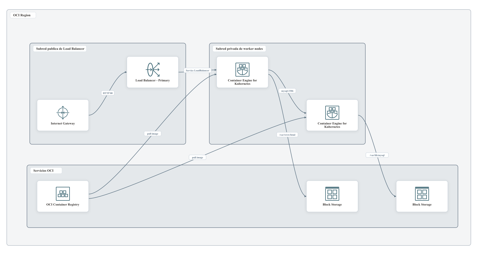
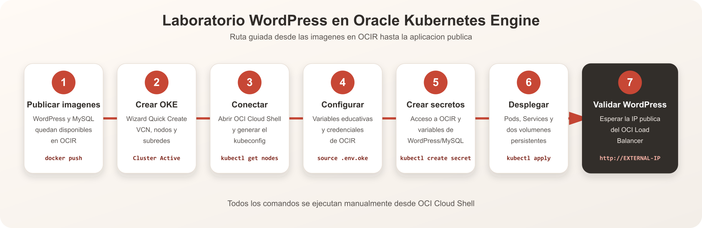

# Modulo WordPress en Oracle Kubernetes Engine

Este modulo despliega una replica de WordPress y una replica de MySQL usando imagenes privadas publicadas previamente en OCIR. MySQL solo se expone dentro del cluster y WordPress se publica mediante un OCI Load Balancer.

## Arquitectura



Cada PVC usa la clase `oci-bv` con acceso `ReadWriteOnce`. Por ello este ejercicio mantiene una replica por Deployment.

## Flujo didactico



Los archivos SVG editables de ambos diagramas estan disponibles en este mismo directorio `images/`.

## 1. Prerrequisitos

- Cluster OKE creado con el wizard **Quick Create** y en estado `Active`.
- Managed nodes en estado `Ready`.
- Acceso configurado desde OCI Cloud Shell.
- Imagenes `wordpress` y `mysql` publicadas en OCIR.
- Cuota para dos Block Volumes de 50 GiB y un Load Balancer.

Verifique el cluster:

```bash
kubectl get nodes
kubectl get storageclass oci-bv
```

## 2. Preparar variables

Desde la raiz de `DevOps-OKE`:

```bash
cd WORDPRESS-OKE
cp .env.oke.example .env.oke
chmod 600 .env.oke
vi .env.oke
```

Complete todos los valores `<...>` de OCIR. Para evitar diferencias durante la practica conserve:

```text
WORDPRESS_DB_PASSWORD=wppassword
MYSQL_ROOT_PASSWORD=rootpassword
```

Importe las variables:

```bash
set -a
source .env.oke
set +a
```

Compruebe que no queden marcadores:

```bash
if grep -Eq '^[A-Z_]+=.*<[^>]+>' .env.oke; then
  echo "ERROR: complete todos los valores <...> de .env.oke"
  return 1 2>/dev/null || exit 1
fi
```

## 3. Validar las imagenes de OCIR

```bash
printf '%s' "$OCIR_AUTH_TOKEN" | docker login "${OCIR_REGION_KEY}.ocir.io" \
  --username "${OCIR_TENANCY_NAMESPACE}/${OCIR_USERNAME}" \
  --password-stdin

docker pull "$WORDPRESS_IMAGE"
docker pull "$MYSQL_IMAGE"
```

No continue si alguna imagen no puede descargarse.

## 4. Renderizar el manifiesto

```bash
sed \
  -e "s|__WORDPRESS_IMAGE__|${WORDPRESS_IMAGE}|g" \
  -e "s|__MYSQL_IMAGE__|${MYSQL_IMAGE}|g" \
  k8s/wordpress-oke.yaml.template \
  > k8s/wordpress-oke.rendered.yaml

grep 'image:' k8s/wordpress-oke.rendered.yaml
kubectl apply --dry-run=client -f k8s/wordpress-oke.rendered.yaml
```

## 5. Crear namespace y secretos

```bash
kubectl create namespace "$OKE_NAMESPACE" \
  --dry-run=client -o yaml | kubectl apply -f -
```

Secret para descargar las imagenes privadas:

```bash
kubectl -n "$OKE_NAMESPACE" create secret docker-registry ocir-secret \
  --docker-server="${OCIR_REGION_KEY}.ocir.io" \
  --docker-username="${OCIR_TENANCY_NAMESPACE}/${OCIR_USERNAME}" \
  --docker-password="$OCIR_AUTH_TOKEN" \
  --docker-email="$OCIR_EMAIL" \
  --dry-run=client -o yaml | kubectl apply -f -
```

Secret educativo para WordPress y MySQL:

```bash
kubectl -n "$OKE_NAMESPACE" create secret generic wordpress-db \
  --from-literal=WORDPRESS_DB_NAME="$WORDPRESS_DB_NAME" \
  --from-literal=WORDPRESS_DB_USER="$WORDPRESS_DB_USER" \
  --from-literal=WORDPRESS_DB_PASSWORD="$WORDPRESS_DB_PASSWORD" \
  --from-literal=MYSQL_ROOT_PASSWORD="$MYSQL_ROOT_PASSWORD" \
  --dry-run=client -o yaml | kubectl apply -f -
```

## 6. Validar y desplegar

Confirme que Cloud Shell apunta al cluster correcto:

```bash
kubectl config current-context
kubectl get nodes
```

Valide el manifiesto contra el API Server y luego despliegue:

```bash
kubectl -n "$OKE_NAMESPACE" apply --dry-run=server \
  -f k8s/wordpress-oke.rendered.yaml

kubectl -n "$OKE_NAMESPACE" apply \
  -f k8s/wordpress-oke.rendered.yaml

kubectl -n "$OKE_NAMESPACE" rollout status deployment/mysql --timeout=10m
kubectl -n "$OKE_NAMESPACE" rollout status deployment/wordpress --timeout=10m
```

## 7. Verificar WordPress

```bash
kubectl -n "$OKE_NAMESPACE" get pods,svc,pvc
kubectl -n "$OKE_NAMESPACE" get events --sort-by=.lastTimestamp
kubectl -n "$OKE_NAMESPACE" get svc wordpress -w
```

Cuando `EXTERNAL-IP` tenga un valor, abra `http://<EXTERNAL-IP>`.

Si aparece `ImagePullBackOff`, revise la ruta, region y credenciales de OCIR. Si un PVC queda `Pending`, revise `oci-bv`, las policies y la cuota de Block Volume. Para investigar el Load Balancer use:

```bash
kubectl -n "$OKE_NAMESPACE" describe service wordpress
```

## 8. Limpieza

```bash
kubectl delete namespace "$OKE_NAMESPACE"
```

Confirme en OCI Console que el Load Balancer y los Block Volumes fueron eliminados.

## Referencias oficiales

- [OKE Quick Create](https://docs.oracle.com/en-us/iaas/Content/ContEng/Tasks/contengcreatingclusterusingoke_topic-Using_the_Console_to_create_a_Quick_Cluster_with_Default_Settings.htm)
- [Acceso al cluster desde Cloud Shell](https://docs.oracle.com/en-us/iaas/Content/ContEng/Tasks/contengdownloadkubeconfigfile.htm)
- [Consumir imagenes de OCIR desde OKE](https://docs.oracle.com/en-us/iaas/Content/ContEng/Tasks/contengpullingimagesfromocir.htm)
- [PVC con OCI Block Volume](https://docs.oracle.com/en-us/iaas/Content/ContEng/Tasks/contengcreatingpersistentvolumeclaim_topic-Provisioning_PVCs_on_BV.htm)
